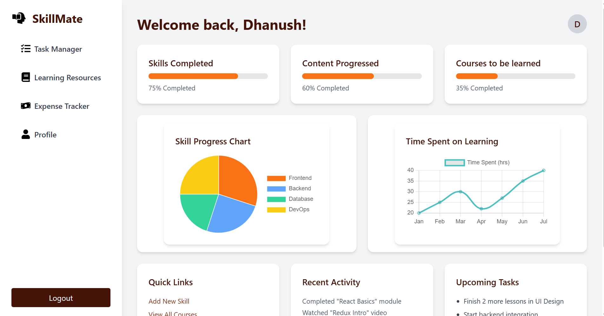
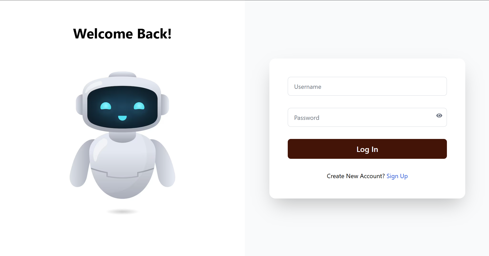
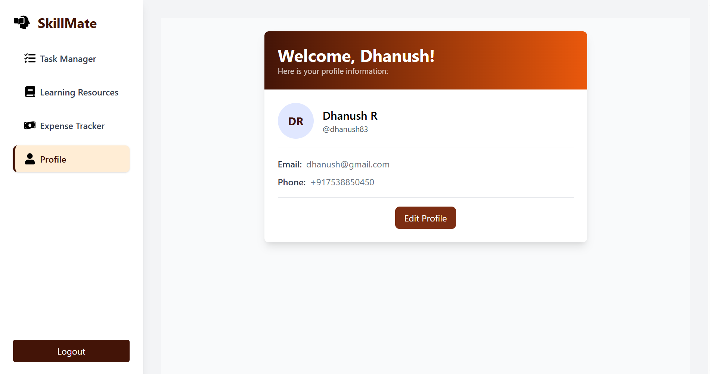

# SkillMate Evaluation 

SkillMate is a full-stack productivity and learning dashboard built with **React**, **Tailwind CSS**, **Redux**, **Express.js**,  and **Twilio OTP** for user authentication. It helps users manage tasks, track learning progress, handle expenses, and access personalized learning resources.

---

## Screenshot


 & (Register.png)
)
![Learning Resources]
![Expense Tracker]
![Profile]

## Features

- OTP-based user registration and login (via Twilio)
- Learning resources browser with tag filters and pagination
- Dashboard with charts and progress indicators
- Task Manager with filters and pagination
- Expense tracker with Redux slice
- Profile Page with user details
- 
---

## Project Structure
Skillmate-evaluation/
├── backend/ # Express.js backend
│ ├── server.js # Entry point
│ ├── auth.js # Auth routes
│ └── ... # Other route files
├── src/ # React frontend
│ ├── Pages/ # React page components
│ ├── redux/ # Redux store and slices
│ ├── App.js # Root component
│ └── index.js # ReactDOM render
├── .env # Environment variables
├── package.json
└── README.md


---

## 🛠 Frontend Setup (React)

```bash
# 1. Clone the repo
git clone https://github.com/Sangsures/Skillmate-evaluation.git
cd Skillmate-evaluation

# 2. Install dependencies
npm install

# 3. Run the frontend
npm start

(App will run on: http://localhost:3000)

## 🛠 Backend Setup (React)

# 1. Go to backend folder
cd backend

# 2. Install dependencies
npm install

# 3. Create a `.env` file with:
TWILIO_ACCOUNT_SID=your_account_sid
TWILIO_AUTH_TOKEN=your_auth_token
TWILIO_PHONE_NUMBER=your_twilio_phone
DB_HOST=localhost
DB_USER=root
DB_PASSWORD=your_mysql_password
DB_NAME=skillmate_users

# 4. Start backend
node server.js

🚀 Deployment
You can deploy the React frontend easily with Vercel:

Connect the GitHub repo

Use build settings:

Build command: npm run build

Output directory: build

## Tech Stack
Frontend: React, Tailwind CSS, Redux

Backend: Express.js, Node.js

Database: Local Storage

Auth: Twilio OTP, Local Storage

License
This project is licensed under the MIT License.

